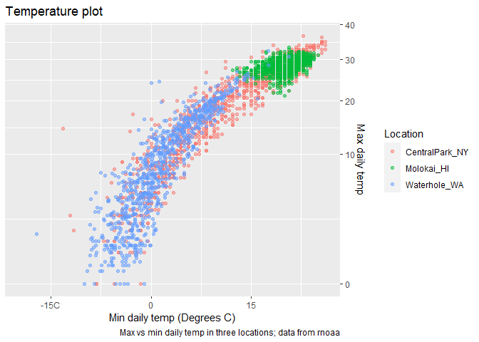
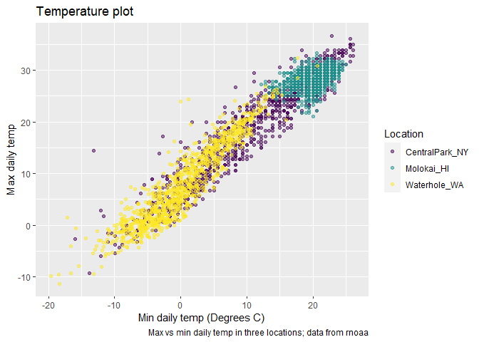

Simple document
================
Nandini M
2023-09-12

``` r
weather_df = 
  rnoaa::meteo_pull_monitors(
    c("USW00094728", "USW00022534", "USS0023B17S"),
    var = c("PRCP", "TMIN", "TMAX"), 
    date_min = "2021-01-01",
    date_max = "2023-12-31") |>
  mutate(
    name = recode(
      id, 
      USW00094728 = "CentralPark_NY", 
      USW00022534 = "Molokai_HI",
      USS0023B17S = "Waterhole_WA"),
    tmin = tmin / 10,
    tmax = tmax / 10) |>
  select(name, id, everything())
```

    ## using cached file: C:\Users\Nandini\AppData\Local/R/cache/R/rnoaa/noaa_ghcnd/USW00094728.dly

    ## date created (size, mb): 2023-10-03 10:22:11.818914 (8.542)

    ## file min/max dates: 1869-01-01 / 2023-09-30

    ## using cached file: C:\Users\Nandini\AppData\Local/R/cache/R/rnoaa/noaa_ghcnd/USW00022534.dly

    ## date created (size, mb): 2023-10-03 10:22:30.954454 (3.838)

    ## file min/max dates: 1949-10-01 / 2023-09-30

    ## using cached file: C:\Users\Nandini\AppData\Local/R/cache/R/rnoaa/noaa_ghcnd/USS0023B17S.dly

    ## date created (size, mb): 2023-10-03 10:22:36.909618 (0.996)

    ## file min/max dates: 1999-09-01 / 2023-09-30

``` r
## Registered S3 method overwritten by 'hoardr':
##   method           from
##   print.cache_info httr
## using cached file: /Users/jeffgoldsmith/Library/Caches/org.R-project.R/R/rnoaa/noaa_ghcnd/USW00094728.dly
## date created (size, mb): 2023-09-19 15:41:55.07359 (8.524)
## file min/max dates: 1869-01-01 / 2023-09-30
## using cached file: /Users/jeffgoldsmith/Library/Caches/org.R-project.R/R/rnoaa/noaa_ghcnd/USW00022534.dly
## date created (size, mb): 2023-09-25 10:06:23.827176 (3.83)
## file min/max dates: 1949-10-01 / 2023-09-30
## using cached file: /Users/jeffgoldsmith/Library/Caches/org.R-project.R/R/rnoaa/noaa_ghcnd/USS0023B17S.dly
## date created (size, mb): 2023-09-19 15:42:03.139582 (0.994)
## file min/max dates: 1999-09-01 / 2023-09-30

weather_df
```

    ## # A tibble: 3,009 x 6
    ##    name           id          date        prcp  tmax  tmin
    ##    <chr>          <chr>       <date>     <dbl> <dbl> <dbl>
    ##  1 CentralPark_NY USW00094728 2021-01-01   157   4.4   0.6
    ##  2 CentralPark_NY USW00094728 2021-01-02    13  10.6   2.2
    ##  3 CentralPark_NY USW00094728 2021-01-03    56   3.3   1.1
    ##  4 CentralPark_NY USW00094728 2021-01-04     5   6.1   1.7
    ##  5 CentralPark_NY USW00094728 2021-01-05     0   5.6   2.2
    ##  6 CentralPark_NY USW00094728 2021-01-06     0   5     1.1
    ##  7 CentralPark_NY USW00094728 2021-01-07     0   5    -1  
    ##  8 CentralPark_NY USW00094728 2021-01-08     0   2.8  -2.7
    ##  9 CentralPark_NY USW00094728 2021-01-09     0   2.8  -4.3
    ## 10 CentralPark_NY USW00094728 2021-01-10     0   5    -1.6
    ## # i 2,999 more rows

``` r
weather_df |> 
  ggplot(aes(x = tmin, y = tmax, color = name)) +
  geom_point(alpha = .5) +
  labs(
    title = "Temperature plot",
    x = "Min daily temp (Degrees C)",
    y = "Max daily temp",
    color = "Location",
    caption = "Max vs min daily temp in three locations; data from rnoaa"
  ) +
  scale_x_continuous(
    breaks = c(-15,0,15),
    labels = c("-15C","0","15")
  ) +
  scale_y_continuous(
    position = "right",
    trans = "sqrt"
   # limits = c(0,30) # zoom into the tmax between 0 and 30
  )
```

    ## Warning in self$trans$transform(x): NaNs produced

    ## Warning: Transformation introduced infinite values in continuous y-axis

    ## Warning: Removed 184 rows containing missing values (`geom_point()`).

<!-- -->

what about colors …

continuous vs discrete color options

``` r
weather_df |> 
  ggplot(aes(x = tmin, y = tmax, color = name)) +
  geom_point(alpha = .5) +
  labs(
    title = "Temperature plot",
    x = "Min daily temp (Degrees C)",
    y = "Max daily temp",
    color = "Location",
    caption = "Max vs min daily temp in three locations; data from rnoaa"
  ) +
#  scale_color_hue(h = c(150,300))
  viridis::scale_color_viridis(discrete=TRUE) #color palette package
```

    ## Warning: Removed 18 rows containing missing values (`geom_point()`).

<!-- -->
